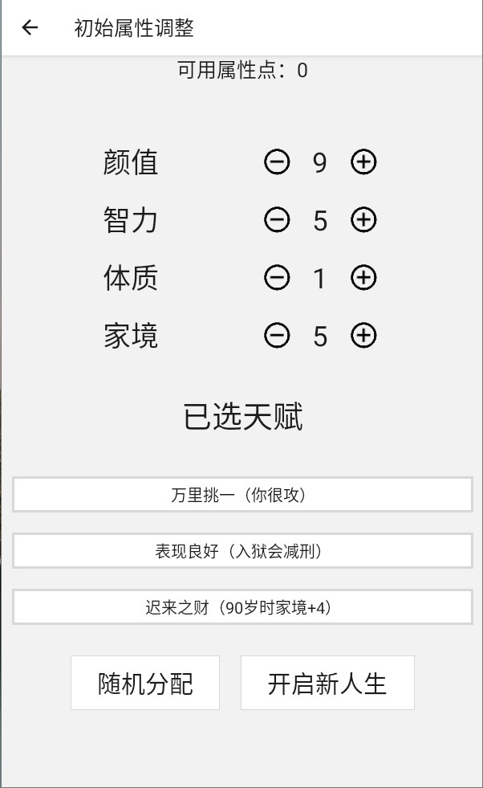
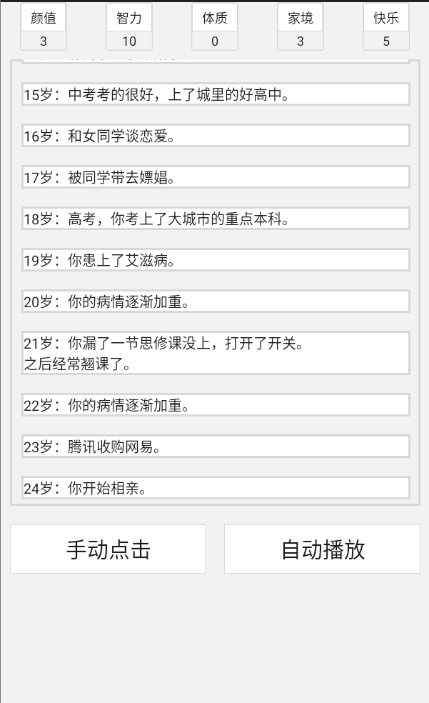

# LifeRestart ReactNative Version



## features

- 无广告!
- 支持本地存储 与 加载 json 文件

目前仅支持编译为Android App

## build

1.

```bash
  npm i expo-cli -g
```

2.

```bash
 cd <project dir> & npm i
```

3.

```bash
  expo build:android
```

## Downloading

[apk下载地址](https://github.com/HuangChenglee/lifeRestart-RN/releases/tag/v1.0)
